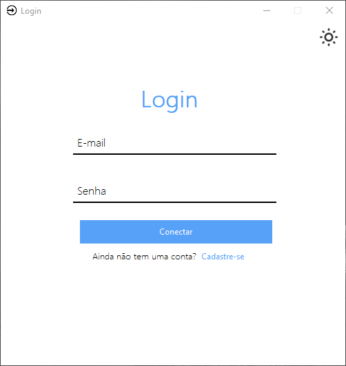
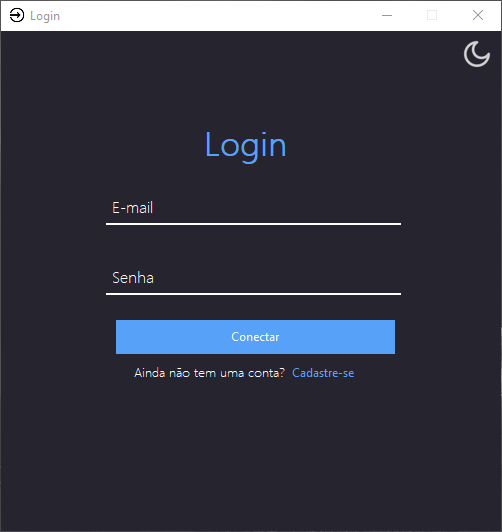
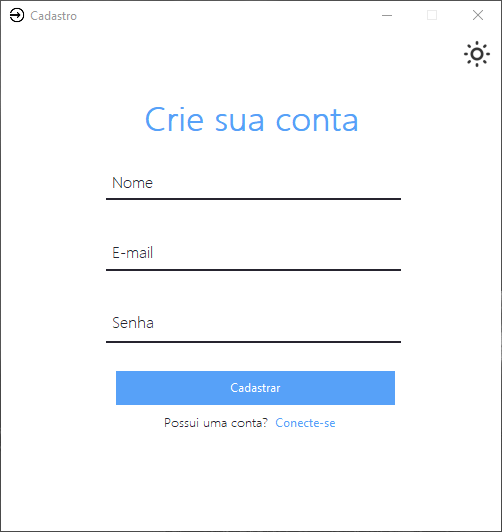
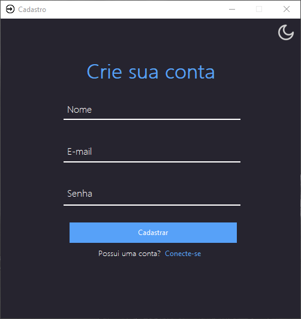

# Login-Cadastro

[](https://github.com/AirthonSantos/Login-Cadastro/blob/master/LICENSE)

## Sobre este projeto

Esse é um projeto pessoal e foi criado para integrar meu portfólio. Procurei refinar esse projeto o máximo que pude e ainda por cima resolvi implementar vários recursos de segurança. Importante dizer que esse é o meu primeiro projeto no github.

A aplicação apresenta uma tela de login com a opção do usuário se autenticar. Além disso, o usuário também pode efetuar o cadastro em outra janela, caso o mesmo não possua.

Esse projeto foi feito com: tkinter, sqlite3, Pillow, re, hashlib e secrets.

- O tkinter foi usado para criar a interface gráfica;
- O sqlite3 foi usado para criar o banco de dados;
- O Pillow foi usado para importar e tratar algumas imagens;
- O hashlib foi usado para calcular a hash da senha do usuário;
- O re foi usado para criar uma expressão regular para verificar se a senha corresponde com os critérios de uma senha forte;
- O secrets serve para gerar um valor aleatório que é concatenado com a senha do usuário antes de calcular a hash.

Além disso, busquei implementar diversos recursos que, inicialmente, podem passar despercebidos. Esses recursos incluem:

- Bloqueio de login, o login é bloqueado após certas tentativas mal sucedidas, o objetivo disso é evitar ataques de brute force. Nesse projeto, coloquei um tempo de espera de 3 segundos, mas poderíamos mudar isso apenas modificando o valor da constante "SEGUNDOS";
- Recurso para alterar a cor da tela (Light e Dark mode);
- A senha do usuário fica escondida (só aparece \*);
- A hash da senha do usuario é armazenada no banco de dados ao invés de armazenar diretamente a senha;
- Quando o usuário clica na caixa de texto, o texto desaparece. E no caso de alguma coisa ter sido digitada, o texto é mantido;
- No momento do cadastro, o usuário só pode cadastrar um e-mail válido, ou seja, precisa ter "@" e ".com";
- Se o e-mail que o usuário está tentando cadastrar já existir no banco de dados, a operação é interrompida e uma mensagem de erro é exibida;
- As queries do SQL utilizam placeholders que servem para impedir ataques SQL Injection;
- O salt serve para aumentar a segurança da senha, dificultando ataques de dicionário e brute force;
- Quando a tela de cadastro é fechada, o programa é encerrado. Isso pode parecer meio óbvio, mas o que acontece é que quando a tela de cadastro abre, a tela de login é ocultada, mas continua aberta. E se a tela de cadastro for fechada, o programa continuaria em execução, e o usuário não poderia encerrar a aplicação corretamente. A fim de resolver esse problema, implementei um recurso que quando a tela de cadastro é fechada, o programa todo é encerrado, incluindo a conexão com o banco de dados;
- Existe um campo no banco de dados chamado de "data_hora". Nesse campo, existe o carimbo de data e hora de quando o usuário foi cadastrado;
- A senha deve atender os requisitos mínimos de uma senha forte:
    - Possuir no mínimo 8 caracteres;
    - Precisa ter uma mistura de letras maiúsculas, minúsculas, números e símbolos (!, @, #, $, %, &, \_).

Por fim, importante citar que o codificador desse projeto é o UTF-8.

## Layout do projeto

### Tela de Login

 

### Tela de Cadastro

 

# Como executar o projeto

## Pré-requisitos

Para esse projeto é necessário ter o python3 e as bibliotecas que foram citadas anteriormente: tkinter, Pillow, sqlite3, re, hashlib e secrets. Praticamente todas essas bibliotecas já integram o Python, com exceção do Pillow. Portanto, para instalá-lo usamos o comando:

```bash
pip install Pillow
```

Obs: Este projeto foi desenvolvido para ser executado no Windows 10. Se você estiver usando outro sistema operacional, algumas funcionalidades podem não funcionar corretamente.

## Execução

Para executar esse projeto, basta executar o comando `git clone` nesse repositório, entrar no diretório "Login-Cadastro" e executar o código.

```bash
# Clona esse repositorio
git clone https://github.com/AirthonSantos/Login-Cadastro

# Entra na pasta
cd "Login-Cadastro"

# Executa o projeto
python "Tela_de_login.py"
```

# Autor

Airthon Santos

https://www.linkedin.com/in/airthonsantos/
